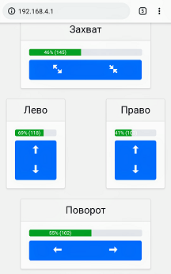

# EEZYbotARM MK1 controller

This is a software component for [EEZYbotARM MK1](https://www.thingiverse.com/make:571332). It is capable of:

* Exposing soft access point
* Running webserver with web interface
* The webserver allows you to manually control the arm through the UI



## Installing

Assuming that you have [PlatformIO](https://platformio.org/) installed and you able to connect your board to computer:

Upload `data` folder to file system SPIFFS: 
```
platformio run --target uploadfs
```

Then build and upload using either Atom or VSCode.

## Running

Your board will start WiFi AP (by default called `Robot` with password `55555555`). Access web UI via `192.168.4.1`.